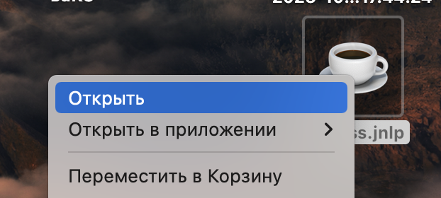
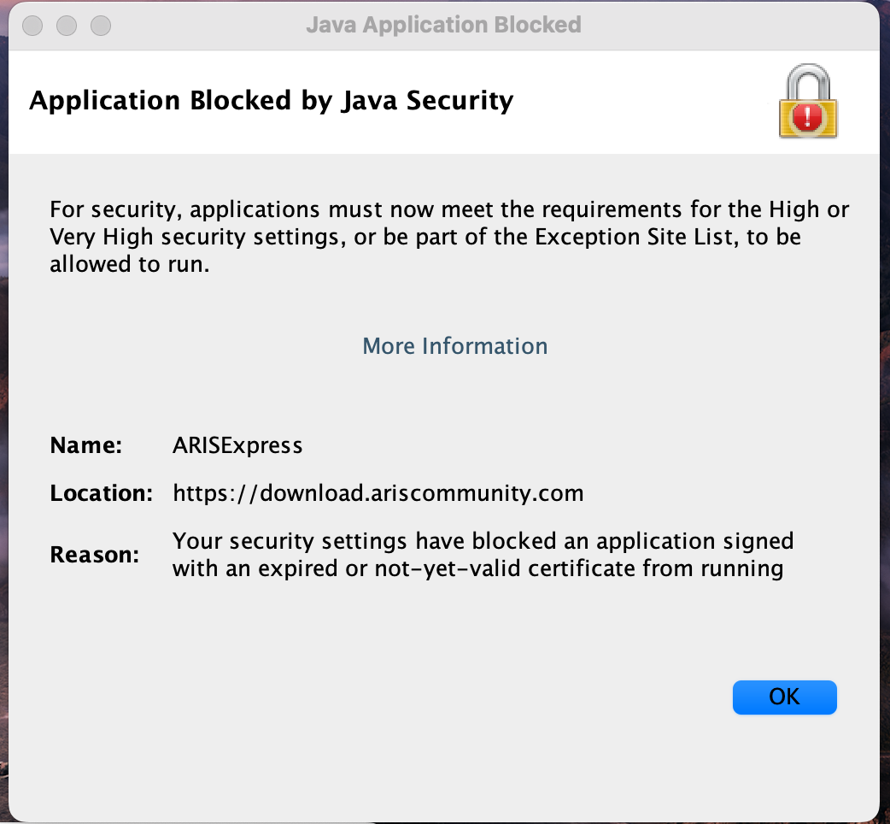
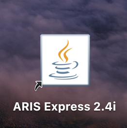

### Как установить ARIS Express на Mac OS (ARM)

_Стоит отметить, что данный способ установки сработал на mac os на архитектуре
чипов m1 и m2._

1) Включить надежный и стабильный VPN.
2) Заходим на сайт установки ARIS Express (https://www.ariscommunity.com/aris-express/download) и выбираем `Free download
for Other Systems`. Если вы не видите этого окна, то необходимо нажать на `log in`  и войти
в заранее зарегистрированный аккаунт
 

3) Скачиваем файл `express.jnlp` и перетаскиваем его на рабочий стол
4) Заходим на сайт Java SE Development Kit 8 (https://www.oracle.com/java/technologies/downloads/#java8-mac) и скачиваем
для Mac os `ARM64 DMG Installer`. Для скачивании у вас потребуется авторизация в аккаунте Oracle - регистрируемся в открывшимся окне.
 

5) Устанавливаем Java SE Development Kit 8
6) Открываем с включенным VPN `express.jnlp` таким способом (правая кнопка мыши)
 

7) Устанавливаем данный файл.
8) После полной установки вы, вероятно, получите предупреждение о том, что запускаемое приложение
заблокировано системой безопасности Java
 

9) Необходимо зайти в Системные настройки и найти там раздел `Java`
 

10) При нажатии на данный раздел у вас откроется `Java Control Panel`. Переходим в пункт `Security`
 

11) Нажимаем на `Edit Site List` и добавляем туда поле с Location `https://download.ariscommunity.com`
 

12) По итогу у вас должно быть также, как на представленном скрине
 

13) Запускаем `express.jnlp` заново, принимаем риски и подтверждаем намерение запустить приложение
 

14) При появлении данного окна нажимаем OK
 

15) Если приложение запросит обновиться на новую версию, но отклоняем данное приложение (Skip This Version/Remind Me Later)
 

16) На данном шаге мы можем удалить `express.jnlp`. Запуск приложения производится `ARIS Express 2.4i` также через правую кнопку мыши (шаг 6)
 

**Готово!**